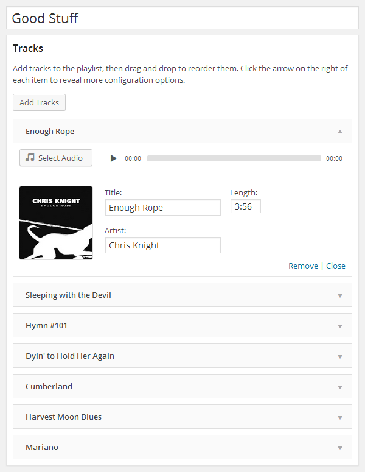
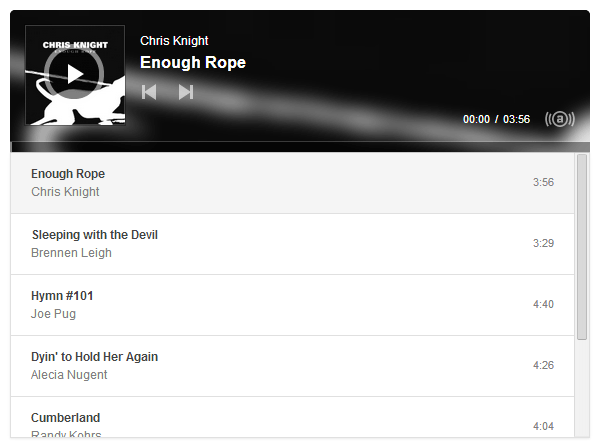

# Cue

Delightful and reliable audio playlists.

__Contributors:__ [Brady Vercher](https://twitter.com/bradyvercher), [Brody Vercher](https://twitter.com/brover), [Luke McDonald](https://twitter.com/thelukemcdonald)  
__Requires:__ WordPress 4.7+  
__License:__ [GPL-2.0+](https://www.gnu.org/licenses/gpl-2.0.html)

*Cue* makes it easy to create and manage beautiful, fully responsive audio playlists. Primarily built with music in mind, *Cue* can also be used for podcasts, sermons or to showcase voice over samples.

There's no need to fiddle with XML, JSON, or FTP. Just upload audio files with the familiar WordPress Media Manager, then insert them into a playlist with the click of a button. *Cue* fetches metadata from uploaded files to automatically complete the title, artist, and length for each track.

It works on desktop, tablets, and other mobile devices.

## Features

* Create unlimited playlists.
* Embed a player in any post, page, or sidebar using a shortcode or widget.
* Reorder tracks with a simple drag and drop interface.
* Seamlessly integrates with WordPress’ media manager to select audio and images.
* Automatically fetches title, artist, and length from the metadata if it's available.
* Completely responsive to work on any device that supports your audio format.
* Link to external sources like Amazon S3 or other CDNs.
* Customize the player background image.
* Use custom artwork for each track.

  
_The interface to add, edit and rearrange a playlist's tracks._

  
_The rendered player on the front end._

## Installation

[*Cue* is in the WordPress.org plugin directory](https://wordpress.org/plugins/cue/) and can be installed from your admin panel.
